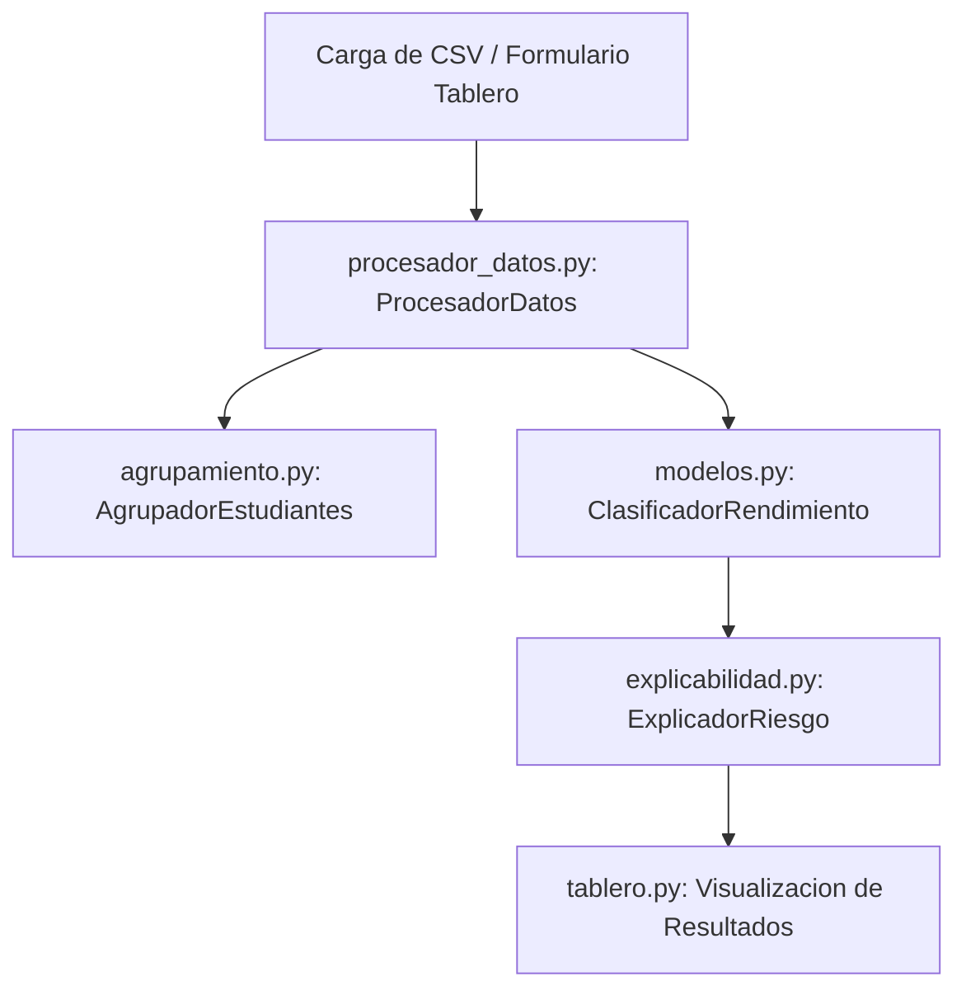

# Documento de Arquitectura y Diseno de Software

Este documento describe la arquitectura, la estructura modular y la aplicacion de paradigmas de programacion en el sistema de analisis de riesgo y prediccion de rendimiento estudiantil.

---

## 1. Arquitectura del Sistema

El sistema sigue un diseno modular dividido en capas de responsabilidad clara:

*   **Capa de Datos:** Encargada del consumo de datos crudos (archivos CSV con delimitador autodetectado).
*   **Capa de Negocio y Preprocesamiento:** Normaliza las variables continuas y mapea la variable objetivo.
*   **Capa de Modelado (Supervisado y No Supervisado):** Realiza las agrupaciones socioeconomicas y las clasificaciones de estado del estudiante.
*   **Capa de Explicabilidad:** Calcula los impactos locales SHAP para descifrar las predicciones.
*   **Capa de Presentacion:** Dashboard interactivo en Streamlit.

---

## 2. Aplicacion de Paradigmas de Programacion (Rubrica de Excelencia)

Para cumplir con el criterio de excelencia de la rubrica, el software implementa tres paradigmas de programacion de manera justificada:

### Paradigma A: Programacion Orientada a Objetos (POO)
Se utiliza para encapsular el estado y el comportamiento de las operaciones complejas de machine learning, garantizando que el pipeline sea reutilizable y mantenible.
*   **Clases Principales:**
    *   [ProcesadorDatos](file:///c:/Users/Lenovo/OneDrive/Escritorio/rendimiento-estudiantil/src/procesador_datos.py): Mantiene el normalizador entrenado y las columnas numericas identificadas.
    *   [ClasificadorRendimiento](file:///c:/Users/Lenovo/OneDrive/Escritorio/rendimiento-estudiantil/src/modelos.py): Envuelve el estimador seleccionado y provee una API unificada (`entrenar`, `predecir`, `evaluar`).
    *   [AgrupadorEstudiantes](file:///c:/Users/Lenovo/OneDrive/Escritorio/rendimiento-estudiantil/src/agrupamiento.py): Maneja el modelo K-Means y genera descripciones estadisticas agregadas de los grupos.
    *   [ExplicadorRiesgo](file:///c:/Users/Lenovo/OneDrive/Escritorio/rendimiento-estudiantil/src/explicabilidad.py): Inicializa y almacena el calculador de valores SHAP.

### Paradigma B: Programacion Funcional (PF)
Se aplica para aislar efectos secundarios, realizar transformaciones de datos limpias y extender la funcionalidad de metodos mediante decoradores.
*   **Funciones Puras:** Transformaciones en el mapeo de variables continuas y categoricas.
*   **Decoradores:**
    *   `medir_tiempo` en [decoradores.py](file:///c:/Users/Lenovo/OneDrive/Escritorio/rendimiento-estudiantil/src/decoradores.py): Extiende metodos para auditar rendimiento sin modificar su logica interna.
    *   `capturar_errores` en [decoradores.py](file:///c:/Users/Lenovo/OneDrive/Escritorio/rendimiento-estudiantil/src/decoradores.py): Centraliza la captura de excepciones no controladas e implementa logs limpios.

### Paradigma C: Programacion Procedural (PP)
Orquesta el flujo secuencial de ejecucion del pipeline para cargas masivas, descargas y configuracion de scripts.
*   **Archivos de Guion (Scripts):**
    *   [descargar_datos.py](file:///c:/Users/Lenovo/OneDrive/Escritorio/rendimiento-estudiantil/descargar_datos.py): Secuencia lineal de descarga, descompresion, validacion y guardado.
    *   `pruebas/test_procesador.py`: Ejecucion de tests unitarios ordenados secuencialmente.

---

## 3. Politica de Manejo de Excepciones

El sistema cuenta con una jerarquia de excepciones en [excepciones.py](file:///c:/Users/Lenovo/OneDrive/Escritorio/rendimiento-estudiantil/src/excepciones.py):
*   `ErrorValidacionDatos`: Captura formatos invalidos o datos corruptos en el CSV de entrada.
*   `ErrorModeloNoEntrenado`: Asegura que el dashboard o los scripts de evaluacion no llamen a metodos de inferencia sin haber entrenado previamente el clasificador.
*   `ErrorConfiguracion`: Maneja problemas de rutas de archivos inexistentes.
